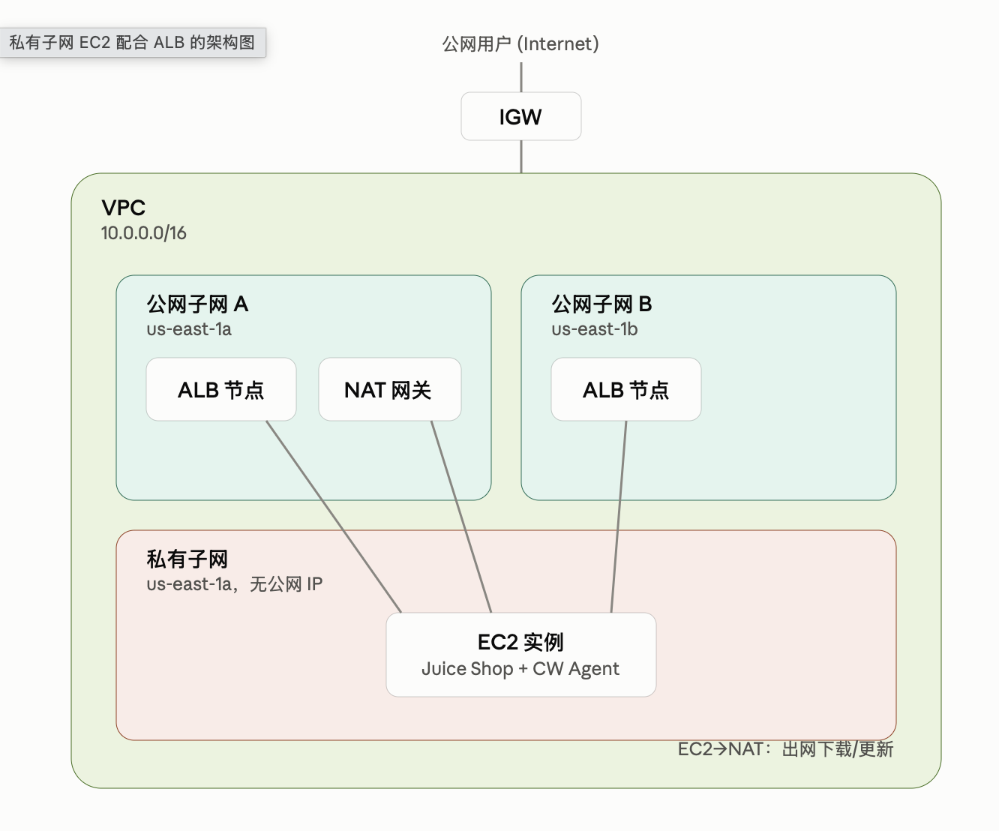

# juice-shop-terraform


This terraform project is used to deploy multiple web security target website into AWS automatically. The commands are listed below:
```
terraform apply -var="target_app=juice_shop"   # 默认
terraform apply -var="target_app=mutillidae"
terraform apply -var="target_app=vuln_bank"
terraform apply -var="target_app=altoroj"
```


## Infrastructure Graph of js-terraform-1.tf


# The architectual graph of js-terraform-2.tf


