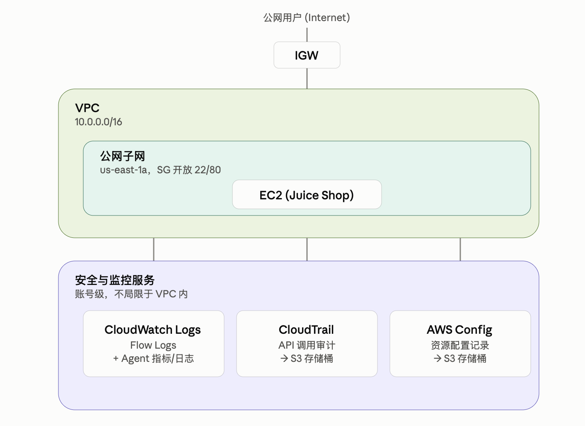
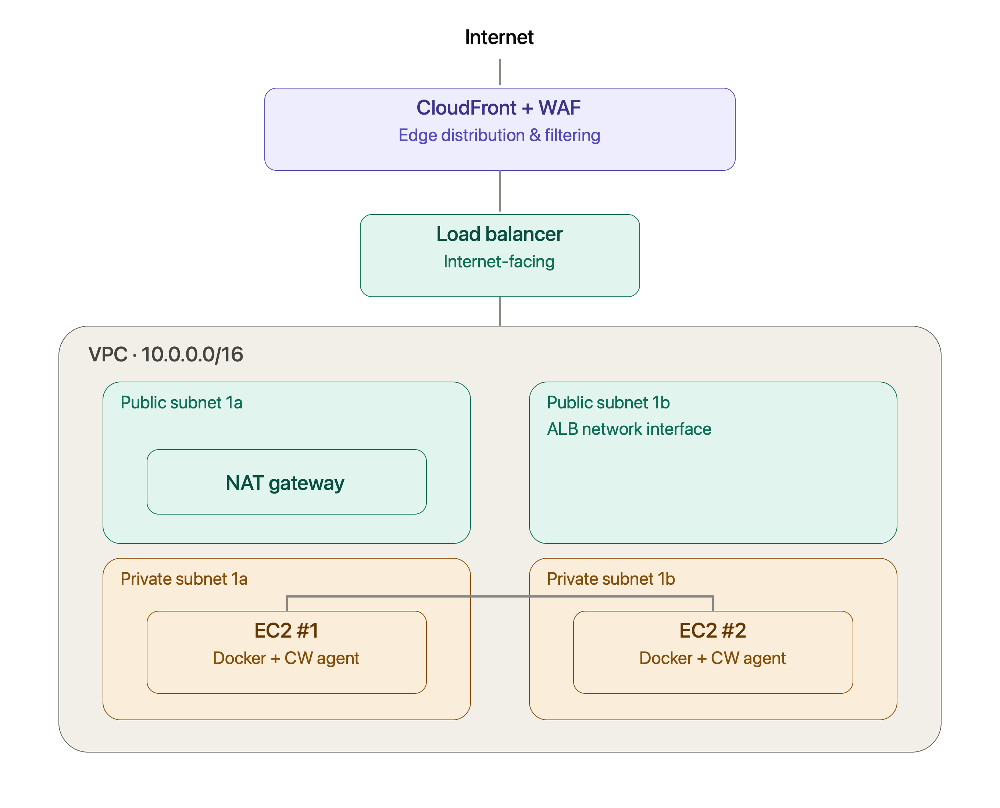
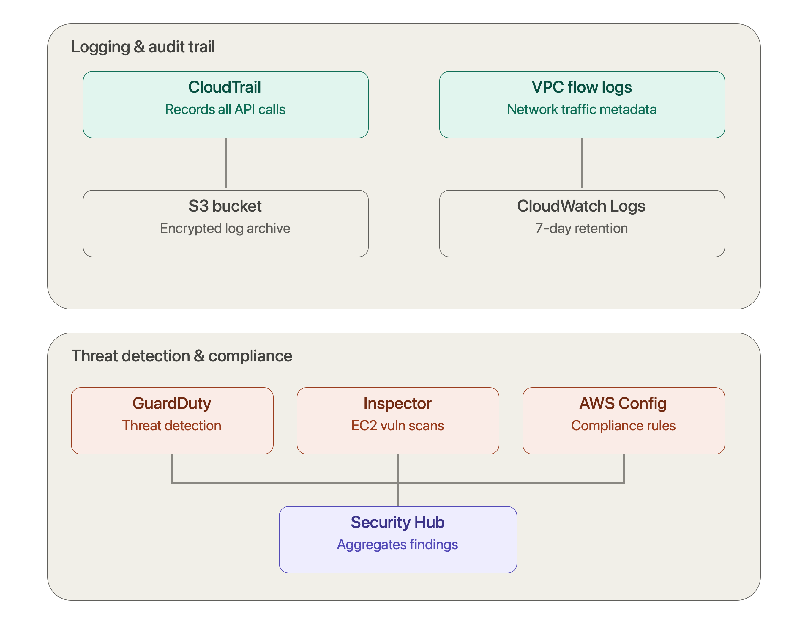

# AWS Cloud Security Lab

A hands-on AWS cloud security lab built with **Terraform**, designed to demonstrate practical implementation of AWS security controls, detection capabilities, vulnerability management, logging, monitoring, and secure infrastructure deployment.

The project deploys vulnerable web applications into an AWS environment and surrounds them with multiple layers of cloud and application security controls.
The commands are listed below:
```
terraform apply -var="target_app=dvwa"
terraform apply -var="target_app=webgoat"
terraform apply -var="target_app=bwapp"
terraform apply -var="target_app=juice_shop"   # by default
terraform apply -var="target_app=mutillidae"
terraform apply -var="target_app=vuln_bank"
terraform apply -var="target_app=altoroj"
```
---

## Architecture

```text
                         Internet
                            |
                            v
                     +-------------+
                     | CloudFront  |
                     +-------------+
                            |
                            v
                         +------+
                         | WAF  |
                         +------+
                            |
                            v
                     +-------------+
                     |     ALB     |
                     +-------------+
                            |
                +-----------+-----------+
                |                       |
                v                       v
          +-----------+           +-----------+
          |   EC2 #1  |           |   EC2 #2  |
          |  Private  |           |  Private  |
          |  Subnet   |           |  Subnet   |
          +-----------+           +-----------+
                |                       |
                +-----------+-----------+
                            |
                     Vulnerable App
                       (Docker)
                            
        -----------------------------------------
                    Security Layer
        -----------------------------------------

        CloudTrail       VPC Flow Logs
             |                 |
             v                 v
          S3 / CW          CloudWatch

        AWS Config -------> Security Hub CSPM
                               |
                         CIS / FSBP
                               |
                               v
                         Findings

        GuardDuty -------> Threat Detection

        Inspector -------> EC2 Vulnerability
                           Scanning

        EventBridge ------> Security Events
              |
              v
             SNS
```

---

## Project Goals

This project is designed to provide hands-on experience with:

* AWS cloud security architecture
* Infrastructure as Code security
* AWS logging and monitoring
* Vulnerability management
* Threat detection
* Security posture management
* Security findings and event-driven response
* Network security
* Web application security
* Secure deployment of vulnerable applications

The goal is to understand how these services work **together**, rather than learning each AWS security service in isolation.

---

## AWS Services

### Infrastructure

* Amazon VPC
* Public and private subnets
* Internet Gateway
* NAT Gateway
* Application Load Balancer
* Amazon EC2
* Docker
* Amazon CloudFront
* AWS WAF

### Detection & Security

* Amazon GuardDuty
* Amazon Inspector
* AWS Security Hub CSPM
* AWS Config
* AWS CloudTrail
* Amazon EventBridge

### Logging & Monitoring

* Amazon CloudWatch
* VPC Flow Logs
* CloudTrail Logs
* CloudWatch Log Groups
* SNS notifications

### Management & Automation

* Terraform
* AWS Systems Manager
* IAM

---

## Security Architecture

### Network Segmentation

The environment uses separate public and private subnets.

```text
VPC
|
+-- Public Subnets
|     |
|     +-- Application Load Balancer
|     +-- NAT Gateway
|
+-- Private Subnets
      |
      +-- EC2 #1
      +-- EC2 #2
```

The vulnerable applications run on EC2 instances in private subnets.

The ALB provides the application entry point, while the EC2 security group does not expose the application directly to the Internet.

---

## Vulnerable Applications

The Terraform configuration supports multiple vulnerable web applications through a configurable application selection.

Currently supported applications include:

* OWASP Juice Shop
* OWASP WebGoat
* DVWA
* bWAPP
* Mutillidae
* VulnBank
* AltoroJ

Example:

```hcl
variable "target_app" {
  default = "juice_shop"
}
```

Changing the variable allows the same infrastructure to deploy a different vulnerable application.

---

# Security Controls

## 1. AWS CloudTrail

CloudTrail records AWS API activity and account-level events.

The project sends CloudTrail logs to:

```text
S3
 |
 +-- Long-term audit storage
 |
 +-- CloudWatch Logs
```

CloudTrail is used to investigate:

* Who performed an action
* What API action was performed
* When it happened
* Which AWS resource was affected
* Which AWS region was involved

Log file validation is enabled to help detect modification of CloudTrail log files.

---

## 2. VPC Flow Logs

VPC Flow Logs capture network traffic metadata from the VPC.

The project sends Flow Logs to CloudWatch Logs.

```text
VPC
 |
 v
VPC Flow Logs
 |
 v
CloudWatch Logs
```

Traffic type:

```text
ALL
```

This allows the lab to investigate network-level activity such as:

* Accepted traffic
* Rejected traffic
* Source IP addresses
* Destination IP addresses
* Source/destination ports
* Network communication patterns

---

## 3. AWS Config

AWS Config continuously evaluates AWS resources against security rules.

The project currently uses rules covering areas such as:

* Unrestricted SSH access
* Root account MFA
* Public S3 read access
* Public S3 write access
* EBS volume encryption
* CloudTrail configuration

Example:

```text
AWS Config
     |
     +-- SSH Security
     +-- Root MFA
     +-- S3 Public Access
     +-- EBS Encryption
     +-- CloudTrail
```

This provides configuration compliance visibility across the environment.

---

## 4. Security Hub CSPM

AWS Security Hub CSPM aggregates security posture findings and evaluates the environment against security standards.

The project enables:

* AWS Foundational Security Best Practices
* CIS AWS Foundations Benchmark

Security Hub CSPM provides a centralized view of security findings.

Example workflow:

```text
AWS Resources
      |
      v
Security Checks
      |
      v
Security Hub CSPM
      |
      v
Findings
```

The project uses Security Hub CSPM to learn how cloud security findings are generated, evaluated, and investigated.

---

## 5. Amazon Inspector

Amazon Inspector is used for vulnerability management.

The current configuration enables EC2 scanning.

```text
EC2
 |
 v
Amazon Inspector
 |
 v
Vulnerability Findings
```

Inspector helps identify vulnerabilities in the EC2 environment and associated software.

---

## 6. Amazon GuardDuty

GuardDuty provides threat detection for the AWS environment.

Unlike Inspector, which focuses primarily on vulnerabilities, GuardDuty focuses on suspicious or potentially malicious activity.

Conceptually:

```text
Inspector
    |
    +-- "Is this workload vulnerable?"

GuardDuty
    |
    +-- "Is something suspicious happening?"
```

This distinction is an important part of the security architecture.

---

## 7. EventBridge

Amazon EventBridge is used as the event-driven security layer.

Planned architecture:

```text
Security Hub
     |
     v
EventBridge
     |
     v
SNS
     |
     v
Email Notification
```

This allows security findings to trigger automated workflows.

Future automation can include:

```text
Security Finding
      |
      v
EventBridge
      |
      +----> SNS Notification
      |
      +----> Lambda
      |
      +----> SSM Automation
```

---

# Logging Architecture

The lab separates different types of security telemetry.

```text
                  AWS Environment
                         |
        +----------------+----------------+
        |                |                |
        v                v                v
    CloudTrail      VPC Flow Logs      AWS Config
        |                |                |
        v                v                v
       S3           CloudWatch         S3
        |                |
        +--------+-------+
                 |
                 v
          Security Analysis
```

This allows the project to demonstrate multiple layers of security visibility:

* API activity
* Network activity
* Resource configuration
* Vulnerability findings
* Threat detection
* Security posture

---

# Terraform

The entire environment is managed using Terraform.

Example structure:

```text
.
├── alb.tf
├── cloudtrail.tf
├── config.tf
├── data.tf
├── ec2.tf
├── flow_logs.tf
├── guardduty.tf
├── iam.tf
├── inspector.tf
├── locals.tf
├── network.tf
├── security_groups.tf
├── security_hub.tf
├── variables.tf
└── outputs.tf
```

Terraform provides:

* Reproducible infrastructure
* Infrastructure as Code
* Version-controlled security configuration
* Automated deployment
* Consistent security controls
* Easier teardown and redeployment

---

# Security Principles Demonstrated

This project focuses on several core cloud security principles.

### Least Privilege

IAM permissions are scoped to the resources and actions required by each AWS service where practical.

### Defense in Depth

Multiple security controls protect and monitor the environment:

```text
CloudFront
    ↓
WAF
    ↓
ALB
    ↓
Security Groups
    ↓
Private EC2
    ↓
Docker Application
```

Additional security visibility comes from:

```text
CloudTrail
VPC Flow Logs
AWS Config
Security Hub
Inspector
GuardDuty
CloudWatch
EventBridge
```

### Network Segmentation

Application workloads run in private subnets while public-facing infrastructure is separated into public subnets.

### Continuous Monitoring

The environment continuously produces security telemetry through:

* CloudTrail
* VPC Flow Logs
* CloudWatch
* AWS Config
* GuardDuty
* Security Hub
* Inspector

### Infrastructure as Code

Security configuration is represented as code rather than manually configured through the AWS Console.

---

# Example Security Workflow

A typical security event can flow through the environment like this:

```text
1. Security issue occurs
          |
          v
2. AWS service detects it
          |
          v
3. Finding is generated
          |
          v
4. Security Hub aggregates the finding
          |
          v
5. EventBridge receives the event
          |
          v
6. SNS sends notification
          |
          v
7. Security engineer investigates
```

Investigation can then use:

```text
CloudTrail
    +
VPC Flow Logs
    +
CloudWatch
    +
AWS Config
    +
Inspector
    +
GuardDuty
```

This creates an end-to-end cloud security detection and investigation workflow.

---

# What I Am Learning

This project is being used to develop practical knowledge in:

* AWS Security
* Cloud Security
* Web Application Security
* Infrastructure as Code
* Terraform
* Network Security
* Vulnerability Management
* Security Monitoring
* Threat Detection
* Incident Investigation
* Event-driven Security Automation
* Docker Security
* AWS IAM
* Security Architecture

---

# Future Improvements

Potential future improvements include:

* EventBridge → SNS security alerting
* Automated remediation using Lambda or SSM
* CloudWatch metric filters and alarms
* More Security Hub standards
* Additional Config rules
* WAF logging and analysis
* ALB access logging
* Centralized security logging
* Automated security testing in CI/CD
* SAST / DAST / SCA integration
* Kubernetes security lab
* Automated Terraform security scanning

---

# Disclaimer

This project intentionally deploys vulnerable applications for security learning and testing.

It should only be deployed in an AWS account and environment that you control.

Do not expose vulnerable applications to the public Internet without appropriate isolation and security controls.

---

# Technologies

```text
AWS
Terraform
Docker
Linux
OWASP
Cloud Security
Web Application Security
Infrastructure as Code
Security Monitoring
Vulnerability Management
```

---

# Project Status

🚧 **Active Learning Project**

The infrastructure and security controls are continuously being expanded as new AWS security concepts are studied and implemented.


## Infrastructure Graph of js-terraform-1.tf




# The architectual graph of js-terraform-2.tf



